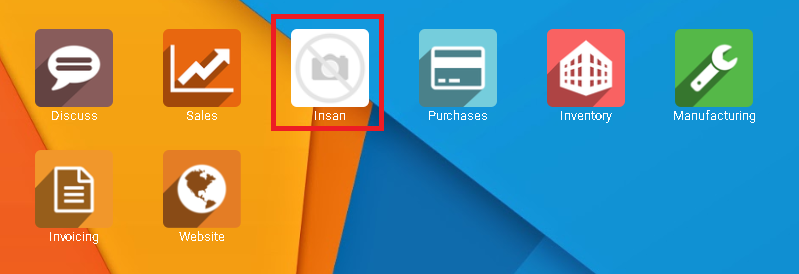

# **Insan**

### Cara Memakai Cost Calculation untuk module ` Insan `

1. Menentukan berapa [Product Category](insan/product_category.md) dan membuatnya
2. Membuat [Product](insan/product.md)
3. Menentukan [BOM Category](insan/bom_category.md)
4. Buatkan [BOM](insan/bom.md) (Bill of Material)

