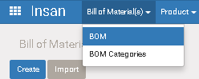
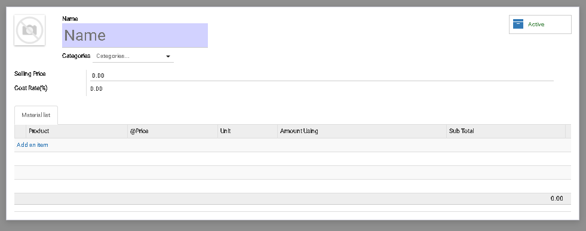

# BOM

BOM (Bill of Material) untuk membuat "Menu Resto".
Satu BOM terdiri dari beberapa [Product](product.md) dan cost [Product](product.md) di hitung bersama menjadi cost BOM.

### Menu

>  Insan > Bill of Material (s) > BOM

Contoh menu bisa lihat di gambar bawah ini:

## 1) Membuat BOM

* Tekan ` Create `

* Masukan detail "BOM" ke field yang ada sesuai gambar di bawah.

|Fields|Required|Descriptions|Default|
|------|--------|------------|-------|
|Name|Yes|Nama untuk kategori||
|[Categories](bom_category.md)|No|Kategory. Satu BOM bisa beberapa category||
|Selling Price|No|||
|Cost Rate|-|System kalkulasi ` 1 + ((sum(Sub Total) - Selling Price) / Selling Price) * 100 ||
|**Material List**|
|[Product](product.md)|Yes|||
|@Price|-|Auto isi setelah ` Product ` di pilih. Field ` After Yield Price `||
|Unit|-|Auto isi setelah ` Product ` di pilih. Field ` Unit of Measure `||
|Amount Using|Yes|Quantity yang di pakai untuk produksi BOM||
|Sub Total|-|Auto kalkulasi system. ` Amount Using x @Price `||
