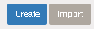

# BOM Category

` BOM Category ` untuk membantu user meng-kategori [BOM](bom.md).

### Menu

>  Insan > Bill of Material (s) > BOM Category

Contoh menu bisa lihat di gambar bawah ini:

## 1) Membuat BOM Category

* Tekan ` Create `

* Masukan detail "BOM Categories" ke field yang ada sesuai gambar di bawah.

|Fields|Required|Descriptions|Default|
|------|--------|------------|-------|
|Name|Yes|Nama untuk kategori||
|Parent Category|No|Bapak kategori||
|Active|No|Tanda apakah kategori ini aktif|Check|
|Color|Yes|Mengasih warna untuk kategori|Grey Blue|

## 2) Tree View

Di ` Tree View ` user bisa melakukan ` Search, Export, dan bebegai fungsi
bersifat laporan`

### 2.1) Search

Field yang dapat di search:

* `Name`
