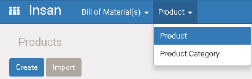
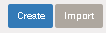
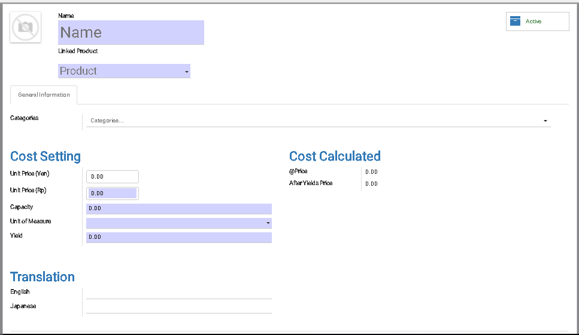

# Product

### Menu

>  Insan > Product > Product

Contoh menu bisa lihat di gambar bawah ini:

## 1) Membuat Product

* Tekan ` Create `

* Masukan detail "Product" ke field yang ada sesuai gambar di bawah.

|Fields|Required|Descriptions|Default|
|------|--------|------------|-------|
|Name|Yes|Nama untuk kategori||
|Product|Yes|Nama untuk kategori||
|[Categories](product_category.md)|No|Kategory. Satu product bisa beberapa category||
|**Cost Setting**|
|Unit Price(Yen)|No|Harga dalam mata uang "Yen"||
|Unit Price(Rp)|Yes|Harga dalam mata uang "Rupiah"||
|Capacity|Yes|Quantity dalam satuan terkecil||
|Unit of Measure|Yes|Satuan||
|Yield|Yes|Percentage penyusutan|Grey Blue|
|**Cost Calculated**|
|@Price|-|Harga satuan. Auto hitung oleh system dengan formula ` Unit Price(Rp) / Capacity `|Grey Blue|
|Yield After Price|-|Harga satuan setelah penyusutan. ` @Price - Yield (%) `||
|**Cost Calculated**|
|English|No|Nama dalam bahasa English||
|Japanese|No|Nama dalam bahasa Japan||
